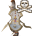
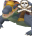

# Cox Mistake Tracker

Tracks mistakes made by players throughout the Chambers of Xeric.

---
This plugin will track mistakes for you and your teammates in the Chambers of Xeric.

By default, when detecting a mistake, all players with this plugin will receive a public message of the mistake, a chat
overhead above the player who made the mistake, and the mistake will be added to the Cox Mistake Tracker side-panel.

Current mistakes being tracked:

*  **Deaths** throughout the raid
    *  **Death in a Combat/Puzzle Room**
    *  **Death in Olm**
* **Olm standard attack** non-jad prayer miss (no announcement) 1339p mage - 1340p range
* **Olm prayer orb** damage 1343p ranged  1341p mage 1345p melee

* **Olm crystal burst** damage 1338gfx 30034o

* **Olm teleports** damage 
* **Olm burn** spread 1349p
* **Olm fire wall** damage 26209o
* **Olm falling crystal** (Crystal Phase) damage
* falling crystal attack 1353gfx 1447

* **Lizardman Shamans spawn** damage

* **Tekton** trap underneath -> not doing this
* **Vanguards** off-prayer damage "I'm getting stacked out" -> not doing this

* **Vespula soldier** spawn -> I want to model export a lux grub for this to use as the icon but I want to check for the vespine solider npc id spawning to determint the mistake

Need to check
* What happens when trasmoging the projectiles to toa ones? Is the prayer orb projectile id maintained?
* does the olm get a different set of animation ids when it's glowing?

* I really need to setup a way to track team mistakes since the following mistakes shouldn't be for individual players
* I don't think the guardians boulder is registering on the right tick. wait no I think I'm just an idiot and made is a 3x3
  need to check to see whether it really is a 3x3 or if it's only the one tile.
* **Vanguards** reset
* why isn't the teleport damage mistake being tracked right? 
* what is vasa's npc id before waking up since that's what I'll have to use to change the room id

Team mistakes:
* muttadile heal (big and small)
* vanguards reset
* olm center
* olm special occurs
* olm hand reset

For team mistakes I really want to have the chat message appear over the enemies rather than every individual team member.

Are these done correctly?
* **Olm melee hand** heal 29887ID -> doesn't seem like the tracker I was doing there worked
* **Olm mage hand** reset 29884id
* **Olm melee hand** reset

1114a

Finished:
* **Olm crystal burst** occurs - not always a mistake but worth tracking - counted by phase (ex. 1, 2, 3, head for <8 players) 30033o (create) 30334o (burst) 1114a for the player
* **Olm lightning** occurs - not always a mistake but worth tracking - counted by phase (ex. 1, 2, 3, head for <8 players) 1356gfx
* **Olm teleports** occurs - not always a mistake but worth tracking - counted by phase (ex. 1, 2, 3, head for <8 players) 1359gfx
* **Tekton spark** damage - 659gfx
* **Olm head turn** center - disabled in solo raids a7342 a7340 for the head
* **Olm lightning** damage
* **Olm acid pools** damage 30032 object
* **Ice Demon attack** damage ranged 1324p mage 366p ice demon boulder gfx 1325 ice demon ice gfx 363
* **Vasa attack** damage 1329p 1330gfx
* **Guardians boulder** damage 645p 305gfx
* **Olm falling crystal** (Transition Phase) damage 1357 1358 1447gfx 1357gfx / 1358gfx falling crystal beetween first phases
* **Olm falling crystal** (Head Phase) damage 1353gfx falling crystal attack
* **Lizardman Shamans poison blob** damage 1293p
* **Muttadiles baby** reset
* **Muttadiles mother** reset
* Does the logic for only counting ice demon/vasa mistakes if the hit is > 0 work? yes!!
* **Olm crystal bomb** damage 29766 40gfx
* Does the olm falling crystal have some gfx appear on the tick it deals damage? yes -> great use that, no -> probably use the projectile id
* What is the falling crystal projectile id vs gfx id
* Why isn't the crystal burst detection working? -> the gfx appears after the player has already been pushed to a different tile so now I just detect it with the animation change

Issues: Taking damage is sometimes not a mistake (though I think this is exclusively dependent on whether or not vengeance is up)

Mistakes that I would like to track:
* Off-prayer unavoidable damage w/o vengeance up (ex. not praying mage against mystics)
* Avoidable damage w/o vengeance up (ex. vasa projectile)
* Wrong color orbs hitting crystals in crabs / just using extra orbs in crabs (more than 5 - e.g. 4 crystals + 1 missed on entry)

---

## Screenshots

---

## Changes

#### 1.0

* Initial release